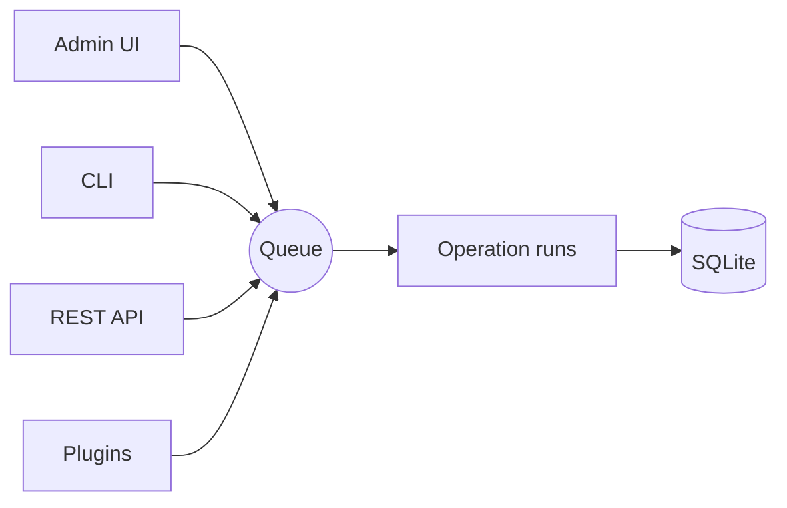
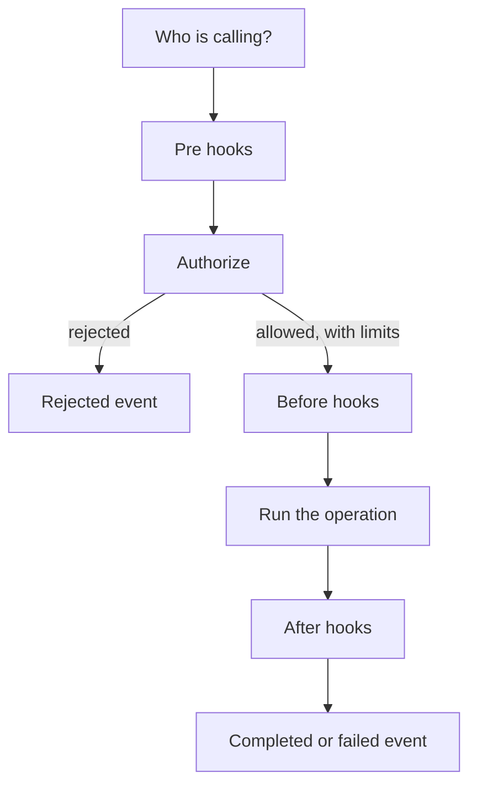
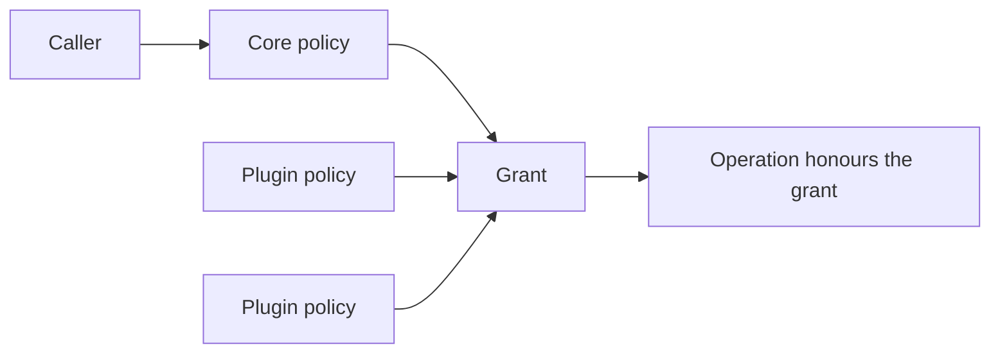
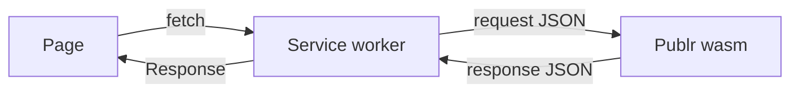

# Architecture

Publr is built around one idea: **everything is an operation.**

Creating a record, listing content types, uploading media, logging in: each is
an operation with a name, an input and an output. An operation is the unit of
work: it is dispatched, it happens, and it is gone. The admin UI, the CLI, the
REST API and plugins do not have their own logic. They all dispatch the same
operations through the same pipeline.

Because there is exactly one pipeline, everything that must hold for the whole
system (permissions, transactions, logging, events) happens there, once.
Nothing can bypass it.

## What happens when an operation runs

1. **Who is calling**: an anonymous visitor, a signed-in user, an API token,
   the local operator on the CLI, or a plugin.
2. **Pre hooks** run for every call, even ones that will be rejected. This is
   where rate limiting and abuse protection live.
3. **Authorize**: the answer is not just yes or no. It is a *grant*: yes, but
   only these content types, only published records, only your own records,
   never these fields. The operation must respect the grant. A rejection is
   itself an event, so it can be logged and reacted to.
4. **Before hooks**: plugins may inspect or change the input, or veto.
5. **Run**: the operation does its work. If it writes, it runs inside a
   database transaction: it either fully happens or leaves no trace.
6. **After hooks**: plugins observe the result.
7. **Event**: completed or failed. Logging, activity history, live updates and
   monitoring are all listeners of these events; none of them are special.

An operation can dispatch other operations. The nested one goes through the
same pipeline, shares the same transaction, and remembers which operation caused
it.

## Permissions

Every call is judged by a chain of policies that produces a grant. Policies
only ever narrow a grant, and any deny wins. Who gets what:

- **Anonymous visitors** can only read live records of public types, and sign
  in (see [Authentication](auth.md)). Nothing else: no types, no statuses, no
  private records. When in doubt, Publr does not allow.
- **Signed-in users** can do what their assigned role allows. Two roles
  ship with the core: `admin` (everything) and `editor` (all content, no
  user or settings management).
- **API tokens** come in two kinds. A user token acts as the user it belongs
  to, within that user's role. A machine token belongs to no user and carries
  its own policy (what it may read and write); that policy becomes its grant.
- **Plugins** can do what their permission scopes allow. A plugin compiled
  into the binary is trusted and has full access. See [Plugins](plugins.md).
- **The CLI** has complete control. Run with `--as <user>` it has exactly what
  that user's role allows, nothing more.

Plugins add policies for finer rules: per-type access, "editors see only their
own drafts", custom roles.

## Content

Content types are data, records are records of a type in a status, and every
field value is its own row. Everything with fields is a record in the same
two tables, plugins included; statuses are a registry. See
[Content](content.md).

## Plugins

A plugin can add operations, policies, hooks, statuses and content types, and
its operations appear in the CLI and the REST API automatically. It
cannot reach around the pipeline: whatever it does, it does through the same
operations, judged by the same policies. See [SDK](sdk.md) and
[Plugins](plugins.md).

## Native or in the browser

The same Publr runs in two places. Natively it is one binary listening on a
port. In the browser it is the same code compiled to WebAssembly, loaded by a
service worker that forwards every request the page makes to the module and
returns its response, with the database kept in memory and saved to the
browser's storage. Nothing in the worker knows what Publr is; it only carries
requests in and responses out. See [Publr in the browser](browser.md).

## Why this shape

- **One pipeline** means permissions and audit are correct by construction, not
  by discipline.
- **Data, not code** for content types and statuses means plugins and the
  admin UI can extend Publr without recompiling it.
- **Small core** means the parts everyone depends on stay reviewable. Anything
  that is not needed for editing content lives outside the core.
