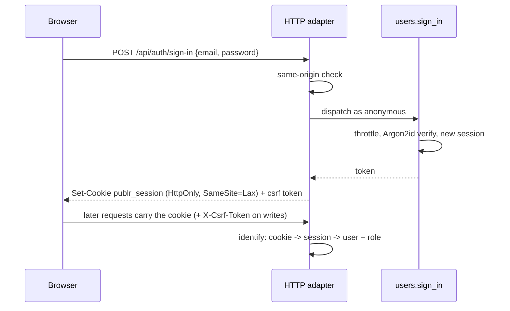

# Authentication

How people get in, and how Publr keeps everyone else out. The mechanics live in
operations (`site.init`, `users.sign_in`, `users.sign_out`,
`users.set_password`, ...) so the CLI, the HTTP routes and plugins all go
through the same doors; see [CLI: users](adapters/cli/user.md) and [REST API](rest.md)
for the surfaces.

## Signing in

Passwords are hashed with Argon2id and never stored. A session is a random
`id.secret` token; only a hash of the secret is stored, so a leaked database
does not leak sessions. Sessions slide (they extend on use) and expire after
thirty days of silence; signing out revokes them.

New accounts can be created with a password, with a generated one shown
once, or with no password at all: then the account is inactive until the
person redeems a one-hour, single-use set-password link (which an admin can
reissue at any time). Setting a password signs out every session of that
account.

Wrong passwords cost the same time as right ones and give the same answer for
unknown accounts, so nothing about who exists leaks. After a handful of
failures an account waits before it may try again, for longer each time (one
minute, then five, fifteen, sixty), and never permanently, so a stranger cannot
lock a real user out. Every attempt is announced as an event
(`auth.sign_in_failed`, `auth.sign_in_succeeded`, `auth.sign_in_throttled`) that
plugins can act on: alerts, CAPTCHA, IP rules, second factors, all belong in
plugins, not the core.

Browser requests that change something must come from the same origin and
carry a per-session CSRF token; requests without a browser cookie (the CLI,
API tokens) are unaffected.

## Roles

Two roles ship with the core. `admin` may do everything. `editor` may manage
content but not users or settings. Signing in, signing out, redeeming a
set-password link and the one-time setup are open to everyone. Finer rules
(per-type access, custom roles) are plugin policies, see
[Architecture: Permissions](architecture.md#permissions).

## Setup, exactly once

`publr init` creates the first admin. It works only while no user exists and
the site has never been initialised; the fact is recorded in the database in
the same transaction, so deleting users later does not reopen it, and nobody
can run it again, not even the local operator. Anyone may call it, so run it
right away.

## What is deliberately not in the core

IP-based limits (the address is whatever a proxy says), CAPTCHA, second
factors, passkeys, SSO, breached-password checks, password expiry, permanent
lockouts, audit persistence. Every sign-in raises an event, so all of these are
plugins on `users.sign_in`, not core features.
