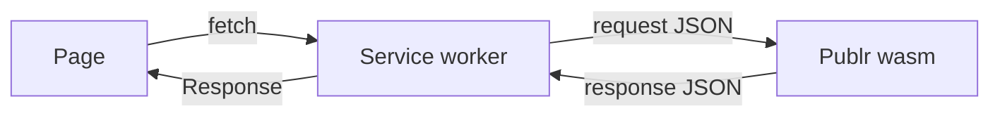

# Publr in the browser

Publr runs in two places from one codebase: natively, as a binary listening on
a port, and in the browser, as the very same code compiled to WebAssembly.
This page is the one place that explains the browser side; every other page
describes Publr once, and it holds for both.

## How it works



A tiny page registers a service worker and reloads. From then on the worker
intercepts every request the page makes to its own origin, hands it to the
Publr module as a JSON envelope (method, path, query, headers, body), and
returns the module's response as a real HTTP response. Publr answers exactly
as the native server would: the same routes, the same operations, the same
permissions. The worker knows nothing about Publr; it only carries requests in
and responses out.

Two things the worker does own, because a service worker cannot see them:

- **the database**: SQLite lives in memory inside the module and is written
  to the browser's storage after every change and restored on the next boot;
- **the session cookie**: `Set-Cookie` and `Cookie` are invisible to service
  workers, so the worker keeps the cookie jar itself and persists it with the
  database.

## Building and running it

```
zig build browser                  # zig-out/browser: publr.wasm, index.html, publr-worker.js
zig build run -- serve --browser   # http://127.0.0.1:8081/
```

`serve --browser [<dir>]` serves that directory as static files (`/` is
`index.html`); after the first load, everything under `/` is answered by the
module in the tab. Native and browser servers run side by side on `8080` and
`8081`. `-Dbrowser-debug=true` builds the module in Debug mode with panic
messages.

## What it is for

Trying Publr without installing anything, demos, offline editing, and one day
a full local-first workflow. It is not a "lite" version: the test suite and
the smoke tests run against the same code, and `zig build verify` compiles the
WebAssembly target on every run.
