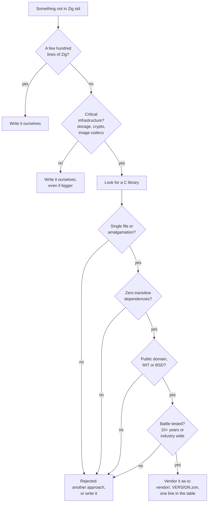

# Dependencies

Publr's rule is that a dependency must be **rare, boring, and ours to keep**.
Rare: the list is deliberately tiny. Boring: mature, permissively licensed,
dependency-free C. Ours to keep: vendored as-is in this repository, compiled by
`zig build`, never fetched, never updated behind our back.

## The list

| Where | What | Version | License | Why it exists |
|---|---|---|---|---|
| `publr_sqlite` (`../demos/cmsv2/lib/sqlite`) | Our own binding, with the SQLite amalgamation inside it | 3.53.4 | Public domain | Storage. The one piece of infrastructure nobody should rewrite. |
| `publr_http` (`../demos/cmsv2/lib/http-server`) | Our own HTTP/1.1 server: fixed capacity, one thread, composed at compile time | sibling checkout | Ours | Every door but the CLI. |
| `publr_auth` (`../demos/cmsv2/lib/auth`) | Our own argon2id hashing, sign-in throttle, CSRF tokens, origin check | sibling checkout | Ours | Signing in, and nothing about users. |
| `vendor/stb/` | `stb_image.h`, `stb_image_resize2.h`, `stb_image_write.h` | 2c980bb | MIT / public domain | Decode, resize and encode images for media. |
| `vendor/libwebp/` | libwebp | 1.6.0 | BSD-3-Clause | WebP encoding for optimized media. |

That is the whole list. Everything else in the binary is Zig, either the
standard library or code in this repository.

The three `publr_*` entries are Publr's own libraries in a sibling checkout,
wired in as *path* dependencies in `build.zig.zon`: nothing is fetched, and a
fix lands in the library once, for every consumer. `src/lib/db.zig`,
`src/lib/http.zig` and `src/lib/auth.zig` are this app's faces on them: the
PRAGMAs, the app type, the re-exports. The line for what goes into a library is
the one in the workspace README: a mechanism whose first example needs no Publr
noun. The C libraries that stay here (`vendor/stb`, `vendor/libwebp`)
each carry a `VERSION.zon` with the upstream, the archive name and its
SHA-256, and the list of files kept. They are compiled once into a static
library per target (`ReleaseFast`), which Zig's cache keeps between builds;
`zig build vendor-cache-check` proves a no-op build recompiles none of it.
See [Build](build.md) for the import procedure.

## Not dependencies

- **Zig itself**, pinned by `.zigversion`. There is no package manager use:
  the only `build.zig.zon` dependencies are Publr's own libraries by path, no
  URLs, no lazy fetches.
- **`std`**: JSON, HTTP parsing helpers, crypto (Argon2id, SHA-256, HMAC),
  compression, all from the standard library.
- **Dev tools** on a machine (a browser for the local smoke test) are never
  part of the build and never in the repository.

## The decision tree

## Worked examples

| Need | Decision | Reasoning |
|---|---|---|
| JSON | `std.json` | Already there. |
| HTTP server | Written by us, as `publr_http` | Not critical infrastructure; a bounded parser and an event loop we want to own, and a second Publr program wanted the same one. |
| Password hashing, throttling, CSRF | Written by us over `std.crypto`, as `publr_auth` | The algorithms are `std`'s; the library is the fixed scratch budget, the dummy hash, the throttle table. |
| Session tokens | `std.crypto` (SHA-256, CSPRNG), in `store/sessions.zig` | Already there; the table is Publr's. |
| Database | SQLite, via `publr_sqlite` | Critical infrastructure; passes every gate. Lives in its own library because a second Publr program needed the same binding. |
| Image decode/resize | Vendor stb | Critical for media; single files, no dependencies. |
| WebP | Vendor libwebp | Critical for media optimisation; BSD, widely used. |
| Markdown | Write it | Not critical, small. |
| WebSocket | Write it, on top of our HTTP layer | Not critical, small. |
| YAML config | Rejected | JSON is enough. |
| libcurl, OpenSSL, libpng, zlib | Rejected | Dependencies of their own, or already covered by `std`/stb. |
| A UI framework, npm anything | Rejected | The UI is compiled to Zig from Publr's own sources; see the roadmap. |

## Replacing a dependency

Any vendored library may be replaced by a pure Zig implementation when the
Zig version passes the same tests and stays within reach of the C version's
speed. SQLite, stb and libwebp are the best available answer today, not
permanent decisions.
