# The map

How Publr is put together, one idea at a time. Each idea is one small
diagram. At the end they are put together into the whole.

## Part 1: from the outside

### What Publr is

Editors write content in Publr; readers get the published part of it.
Everything is one program and one database file.

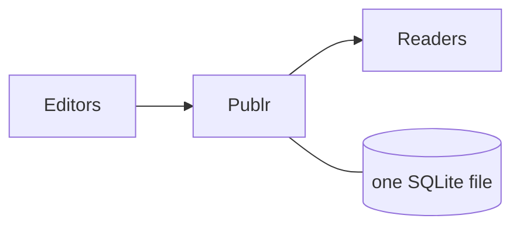

### Three doors, one room

There are three ways to use it. They are fronts on the same thing: anything
one can do, the others can do too.

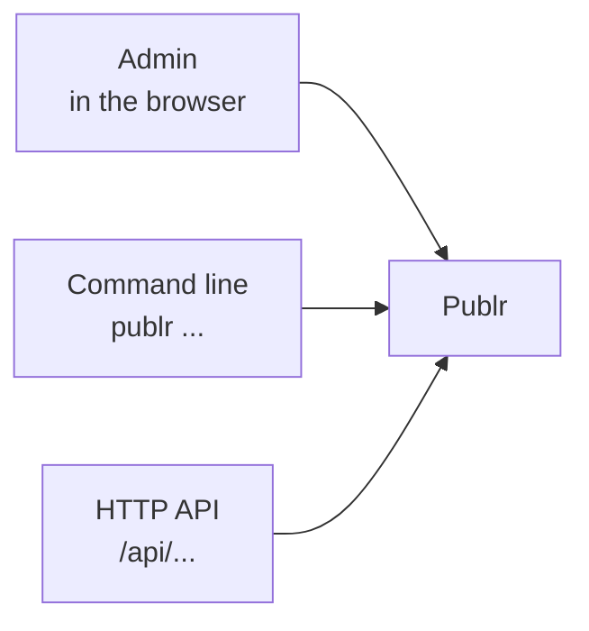

### One action

An action is called an **operation**. It takes an input, does one thing,
gives an output. `record publish` takes a record id and answers with the new
status.

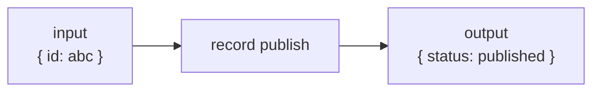

### The same action from each door

Each door just collects the input in its own way (a form, flags, JSON) and
runs the same operation.

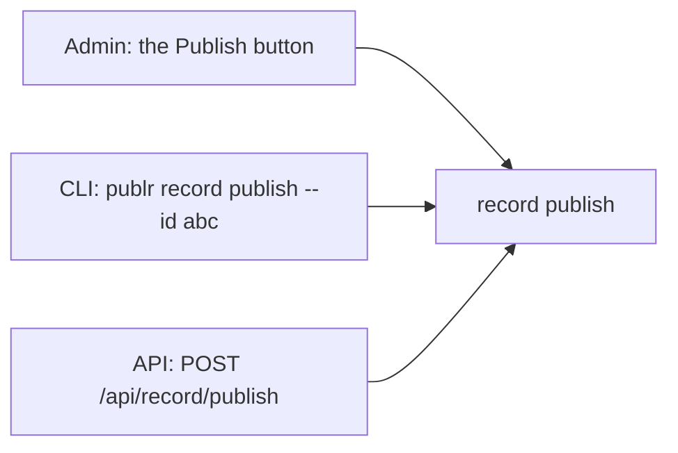

### Operations come in families

About thirty operations, grouped by what they act on. `publr --help` lists
them; the API and the admin offer the same list.

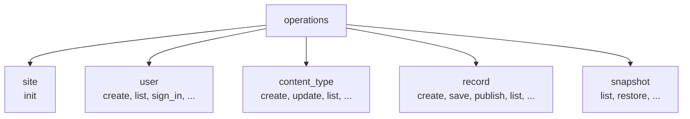

## Part 2: what happens when an operation runs

Every operation, from every door, goes through the same four steps.

### Step 1: who is asking

The door works this out (from the session cookie, or the `--as` flag on the
command line) before anything else happens.

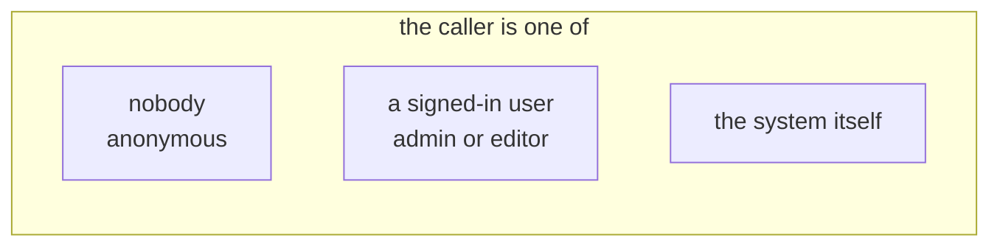

### Step 2: may they

A few rules decide what this caller may do with this operation. Plugins can
add rules of their own.

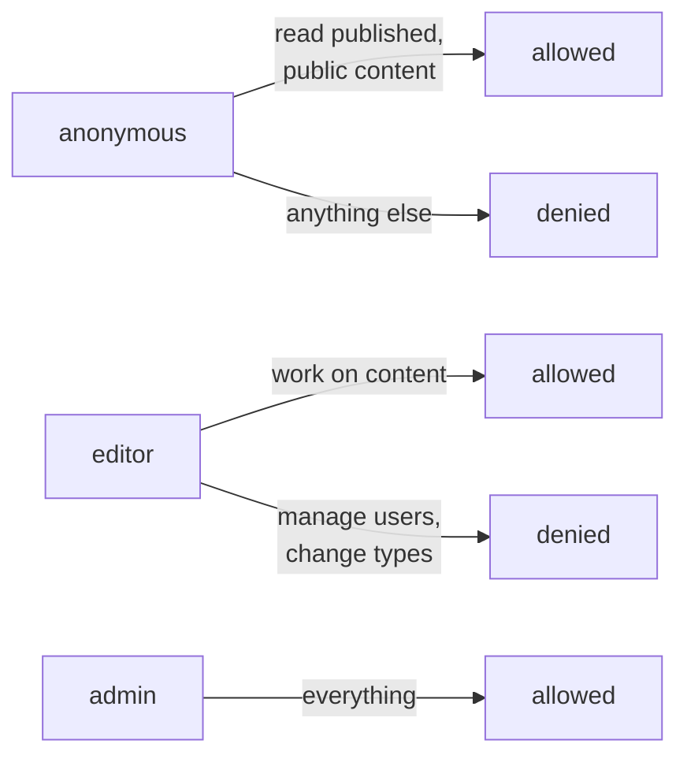

### Step 3: run it, all or nothing

The operation's code runs inside one database transaction. It either fully
happens or leaves no trace.

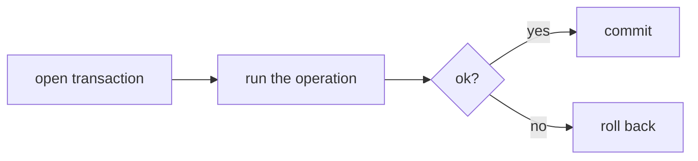

### Step 4: tell whoever listens

When it is done, a named event goes out. Plugins can react (send a webhook,
rebuild a page).

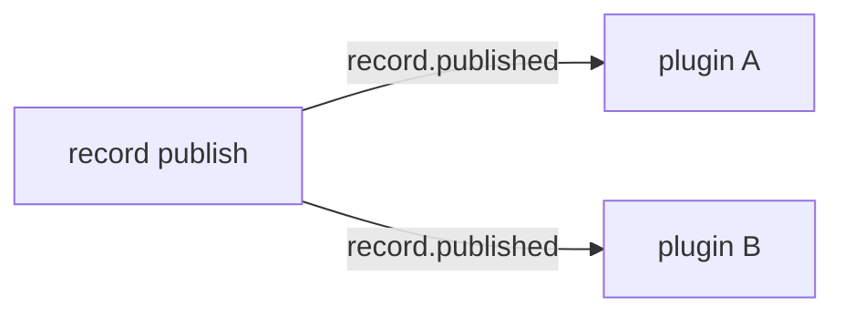

### Put together: the pipeline

This pipeline is one function, `dispatch` in `src/sdk.zig`. Every call
goes through it. If you read one piece of code, read that one.

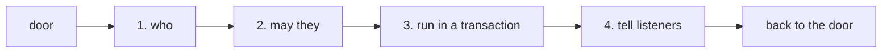

## Part 3: what the content is

### A content type

A content type is a schema: a name and a list of fields, each of a kind.
You make them in the admin (or the CLI); a plugin can declare its own in
code.

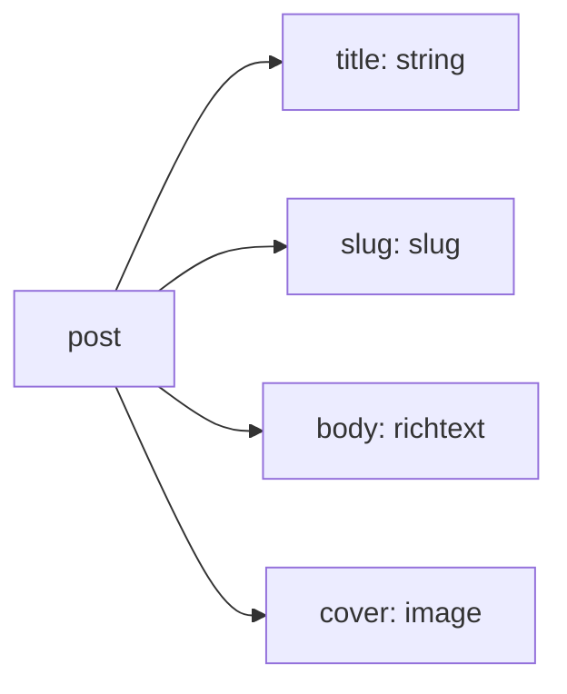

### A record

A record is one piece of content of a type: a status plus a value for each
field.

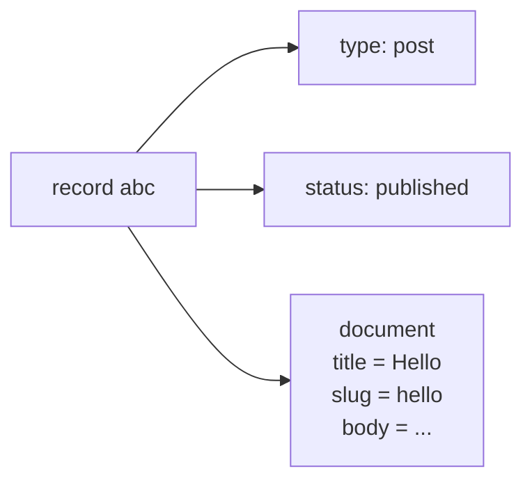

### A record's life

Four statuses. Readers only ever see `published`. Every move can be undone;
`record purge` is the only thing that removes a record for good.

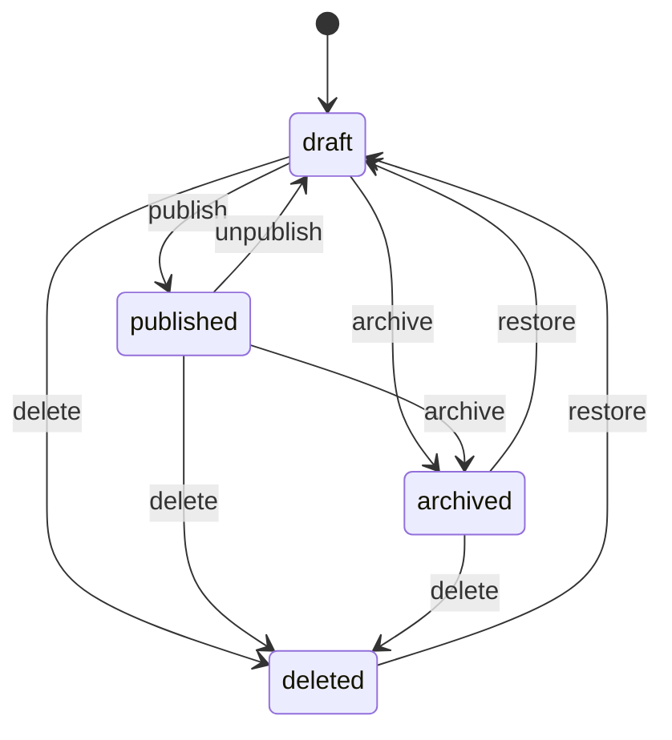

### Editing something that is published

Saving a published record does not change what readers see. The edit is
parked as a pending copy and the record is marked **changed**. Publish makes
the copy live; discard drops it. Unpublishing or archiving keeps the copy.

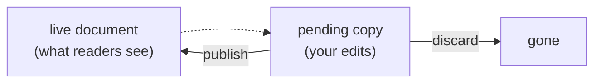

### History

Every time a live document is replaced, the old one is kept as a
**snapshot**. You can view them and restore one (which is itself a normal
edit).

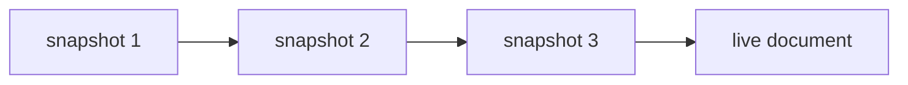

### Put together: how that is stored

Three tables hold all content: the types, one row per record, and one row
per field value (under a slot: `live` or `pending`). Snapshots are beside
them. Users, sessions and settings have their own small tables. Columns are
in [Database schema](schema.md).

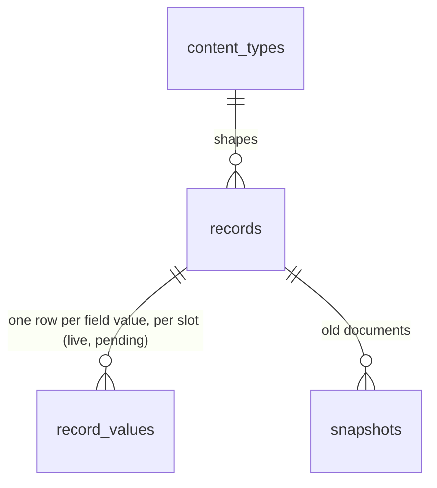

## Part 4: the code

### The layers

The directories are the story in order. Each layer only calls the one below
it.

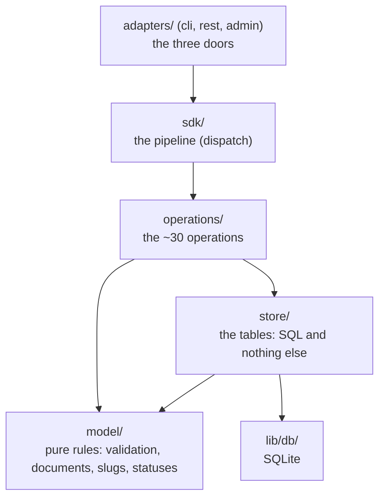

### Every file is one kind of thing

That is the rule the layout enforces, and `tidy` checks it (`scripts/tidy/kinds.zig`).
The directory tells you what a file is, what it may import, and how it is tested:

| kind | directory | is | may import | tested by |
|---|---|---|---|---|
| model | `model/` | pure rules: data in, data out. No database, no HTTP | `std`, other model files | unit tests, table-driven |
| store | `store/` | one table per file; functions are statements | `lib/db/`, `model/` | against a fixture database |
| operation | `operations/` | orchestration: grant, store, model, notices; never SQL | `sdk/`, `store/`, `model/` | scenarios through `dispatch` |
| adapter | `adapters/{cli,rest,admin}/` | outside format in, operation call, outside format out; never the store | `sdk/`, operations | request in, response out |
| pipeline | `sdk/` (+ `sdk/plugin/`) | dispatch, callers, grants, hooks, the plugin contract | `lib/`, `model/` | unit tests |
| wiring | `app/` | starting up: open the database, the registry of everything, the route table, `serve`, wasm | everything | the http flow tests |
| library | `lib/{db,http,auth}/` | mechanisms that know nothing about content: SQLite, an HTTP server, password hashing | each other, `std` | unit tests |

Two adapters are allowed to read the store, because they are where a request
becomes a caller: `adapters/rest/identity.zig` (cookie to caller) and `adapters/cli.zig`
(`--as` to caller).

### Beside the layers

`lib/auth/` is used by the doors to work out who is asking; `lib/http/`
carries the API and admin doors; `sdk/plugin/` feeds rules, listeners and
types into the pipeline. Starting up lives in `main.zig`, `app/serve.zig`, `app.zig`
(`app/wasm.zig` is the same program as WebAssembly).

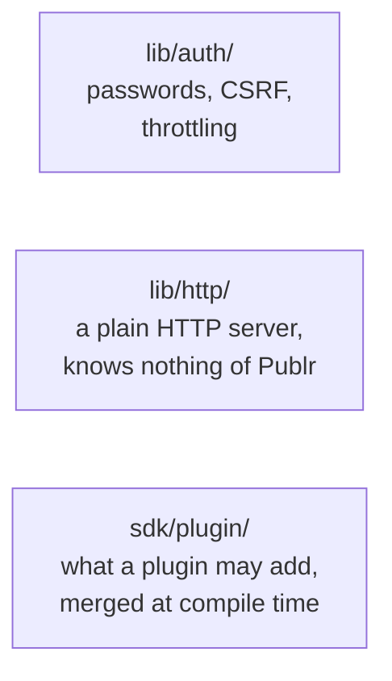

### The whole thing

All of the above in one picture: the doors on top, fed by `lib/auth/` (who is
asking) and carried by `lib/http/`; the pipeline in the middle, fed by
`sdk/plugin/`;
the operations, the content rules and the database below.

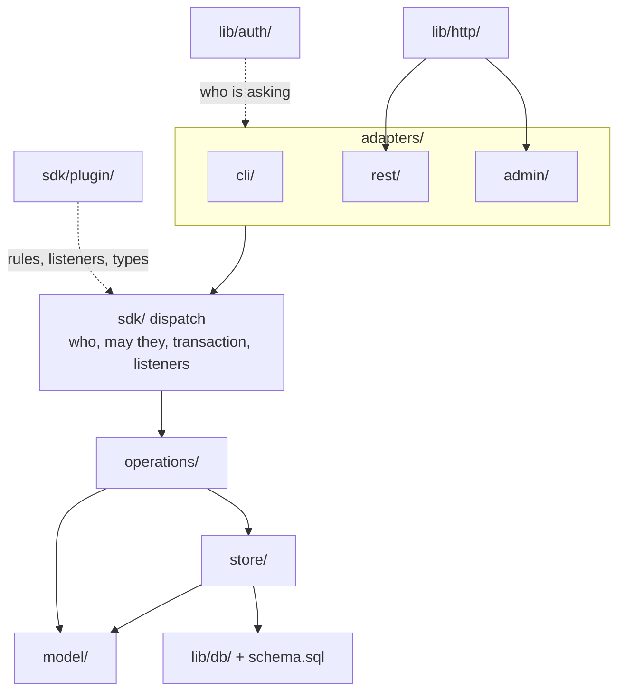

### One button, all the way down

The "Publish changes" button in the admin, through every layer:

1. `adapters/admin/content.zig:action` reads the form and checks it came from our own
   page (same origin, CSRF token).
2. It calls `dispatch` with `record.publish` and `{ id, expected_version }`.
3. `dispatch` (`sdk.zig`) asks the rules (an editor may write records),
   opens a transaction, calls the operation.
4. `record.publish` (`operations/record/lifecycle.zig`) loads the record, checks
   the parked slug is still free, keeps the old live document as a snapshot
   (`store/snapshots.zig`), renames the `pending` slot to `live`
   (`store/values.zig`), bumps the record with `changed` off
   (`store/records.zig`).
5. Commit, `record.published` goes to listeners, redirect back to the record.

## Part 5: reference

### Every file, one line

Grouped by kind. Lines are the whole file, tests included.

#### Entry points
| File | Lines | What |
|---|---|---|
| `main.zig` | 87 | `publr [--db] <cmd>`: `serve` or the CLI |
| `app/serve.zig` | 189 | `publr serve`: open the app, run the HTTP server loop |
| `app.zig` | 86 | Open the database, apply schema and plugin bootstrap, hold auth state |
| `app/wasm.zig` | 255 | The same app as a wasm reactor: init, import a db, answer one request |
| `publr.zig` | 56 | The library root: re-exports every module (what plugins import as `publr`) |
| `app/registry.zig` | 43 | Core + plugin operations/namespaces/policies/hooks/types, the `SDK`, the status registry, bootstrap |
| `app/routes.zig` | 110 | The route table (`/`, `/api/auth/*`, `/api/health`, admin, rest) and a `testing.Flow` that drives the full router |
| `app/site.zig` | 8 | The per-process handle handlers get (`connection`, `auth`, static dir) |

#### model/ (pure)
| File | Lines | What |
|---|---|---|
| `model/field.zig` | 299 | Field kinds, options, `Def`, validation of field definitions |
| `model/content_type.zig` | 153 | A content type `Def`, its validation, JSON encode/decode, id from handle |
| `model/validate.zig` | 416 | A JSON document against a type's fields: problems |
| `model/document.zig` | 487 | A document as rows and back: `flatten` (object to rows, dotted paths, ordinals), `assemble` (rows to object), title and slug rules, path lookup |
| `model/status.zig` | 189 | The status registry (`draft/published/archived/deleted`, transitions), extensible by plugins |
| `model/convert.zig` | 159 | Value conversion when a field changes kind |
| `model/evolution.zig` | 200 | Diff two type definitions into a plan (removed, converted, needs rewrite) |
| `model/account.zig` | 77 | Roles, email normalisation, display-name rule |

#### store/ (SQL only)
| File | Lines | What |
|---|---|---|
| `store/content_types.zig` | 213 | `content_types` table: insert/update/get/list/delete |
| `store/records.zig` | 530 | `records` table: `Record` (with type handle, title, slug joined in), insert/get/save/set_status/list/delete/rename |
| `store/values.zig` | 525 | `record_values` + `record_search`: write flattened rows per slot, read, promote, lookups, delete by field |
| `store/snapshots.zig` | 182 | `snapshots` table: take/get/list/prune |
| `store/users.zig` | 343 | `users` table: insert/find/list/tokens/password |
| `store/sessions.zig` | 324 | `sessions` table: create/validate/slide/destroy, per-user cap |
| `store/settings.zig` | 54 | `settings` key/value get/set |

#### operations/ (the features)
| File | Lines | What |
|---|---|---|
| `operations/heartbeat.zig` | 63 | `heartbeat check` |
| `operations/site.zig` | 148 | `site init` (first admin), `site status` |
| `operations/user.zig` | 540 | `user create/list/password_link/set_password` |
| `operations/sign_in.zig` | 188 | `user sign_in/sign_out`: throttle, session |
| `operations/status.zig` | 51 | `status list` |
| `operations/content_type.zig` | 571 | `content_type create/update/get/list/delete/validate`: evolution (rewrite values, drop removed fields, backfill slugs), locked fields of system types |
| `operations/record.zig` | 784 | `record create/get/save/list/referrers/validate` + their tests |
| `operations/record/access.zig` | 110 | Which records a caller may touch: `load` (grant-checked read), allowed statuses |
| `operations/record/document.zig` | 207 | Helpers that need the store and the model together: read + assemble a slot, unique slug, keep the old live copy as a revision, filters |
| `operations/record/lifecycle.zig` | 379 | `record transition/publish/discard_changes/delete/purge` and the outcome notices |
| `operations/record/fixture.zig` | 18 | The `post` type the record tests write against |
| `operations/snapshot.zig` | 211 | `snapshot list/get/take/restore/prune` |

#### Adapters
| File | Lines | What |
|---|---|---|
| `adapters/cli.zig` | 838 | Args to `In`, dispatch, print `Out`, `--help` from the op docs, `--as` to caller |
| `adapters/rest.zig` | 256 | `GET/POST /api/:namespace/:verb` to the op; query/body to `In`; its http test |
| `adapters/rest/identity.zig` | 173 | Who is making an HTTP request: cookie to caller, CSRF guard for writes, the `Ctx` a handler dispatches with |
| `adapters/rest/auth.zig` | 247 | `/api/auth/*` handlers (sign-in, sign-out, set-password, session) and their http test |
| `adapters/admin.zig` | 356 | Admin routes, `Session`, `require`/`accept`/`param`, `fail`, the admin http test |
| `adapters/admin/page.zig` | 113 | Plain HTML page writer with escaping |
| `adapters/admin/fields.zig` | 190 | Field defs to form inputs to JSON document |
| `adapters/admin/auth.zig` | 212 | Setup, login, logout pages |
| `adapters/admin/types.zig` | 406 | Content types list + editor |
| `adapters/admin/content.zig` | 420 | Records list, new, edit, actions |
| `adapters/admin/revisions.zig` | 214 | Versions explorer + restore |

#### Infrastructure
| File | Lines | What |
|---|---|---|
| `sdk.zig` | 583 | `Registry`, `SDK(registry)`: `dispatch`, `admit`, `run` in a tx, one error boundary (`as_outcome`), hooks, events |
| `sdk/operation.zig` | 249 | What an operation type must declare; `resource_of(in)`; `Docs(In)`; name helpers |
| `sdk/context.zig` | 104 | `Ctx`: caller, db, io, arena, auth, clock, notices |
| `sdk/caller.zig` | 155 | `Caller` union (anonymous, user, system, token, machine, plugin) |
| `sdk/grant.zig` | 267 | `Grant`: allow/deny, type and status filters, transitions, row filter |
| `sdk/authorize.zig` | 286 | The core policy (anonymous reads live+public, editors write content, admins everything); runs plugin policies |
| `sdk/middleware.zig` | 89 | Hook stages (`pre`, `before`, `after`, `on`) and event shapes |
| `sdk/plugin.zig` | 374 | What a plugin module may export; `Merged(plugins)`; compile-time validation |
| `sdk/plugin/context.zig` | 56 | `PluginCtx`: the narrowed ctx a plugin operation receives |
| `sdk/plugin/types.zig` | 139 | Content types declared by plugins: create/update on bootstrap, lock declared fields, keep hand-added ones |
| `lib/auth/password.zig` | 110 | Argon2id hashing and checking |
| `lib/auth/csrf.zig` | 97 | CSRF token derive/verify, origin check |
| `lib/auth/throttle.zig` | 165 | Sign-in throttling by subject |
| `lib/auth/state.zig` | 99 | Process auth state: secret, throttle, hashing params |
| `lib/db.zig` | 394 | `Runtime` (SQLite global init), `Db` (one connection), errors, test fixture |
| `lib/db/statement.zig` | 239 | Prepared statement: bind/step/column |
| `lib/db/transaction.zig` | 154 | `BEGIN IMMEDIATE` / savepoints / commit / rollback |
| `lib/db/schema.zig` | 72 | Apply `schema.sql`; table list |
| `lib/http/server.zig` | 602 | Single-threaded poll loop: accept, read, dispatch, write, keep-alive |
| `lib/http/socket.zig` | 191 | POSIX sockets + poll |
| `lib/http/request.zig` | 425 | HTTP/1.1 request parser |
| `lib/http/response.zig` | 173 | Response builder (headers, text/html/json/redirect) |
| `lib/http/router.zig` | 241 | Pattern routes with `:params`, middleware chain |
| `lib/http/static.zig` | 106 | Serve files from a directory |
| `lib/http/status.zig` | 75 | Status codes |
| `lib/http/form.zig` | 135 | urlencoded bodies and query strings as name/value pairs, percent-decoded |
| `lib/id.zig` | 48 | Ids: 24 hex, random (records, users) or derived from a name (content types) |
| `lib/text.zig` | 57 | Slugs: slugify and numeric suffixes |
| `lib/html.zig` | 32 | HTML escaping |
| `lib/report.zig` | 46 | Print an error box to stderr |

### What is wrong with it today

1. ~~Three shapes for one record~~ done: `store/records.zig:Record` is the one row shape (type handle, title and slug joined in by SQL), operations return it as is; `record get` answers `{ record, slot, document }`.
2. ~~Error mapping everywhere~~ done: operations `try` straight through (`sdk.Error` already contains the storage errors); the one translation left, a broken database constraint becoming `Conflict`, happens in `sdk.zig:as_outcome` when an operation returns. `model/content_type.zig` got a declared error set instead of an inferred one.
3. ~~Operation ceremony~~ done: an operation is `name`, `description` (+ `details`, `field_docs`, `output_docs`), `kind`, `In`, `Out`, `example`, `example_out`, `run`. `resource` is read from `In` by field name (`sdk/operation.zig:resource_of`); `seed` became one example world, which then left `src/` entirely (`scripts/parity.zig`); `volatile_fields` went because parity compares the shape of outputs, not values; `example_caller` is derived from what the policy lets an anonymous caller do.
4. ~~Asserts that restate the compiler~~ done: `tidy` now rejects tautologies, `or true`, type and size restatements (28 removed), fails a non-trivial function only when it asserts nothing, and reports how many functions have a single assertion (two stays the aim: 22 today). Asserts that restate a non-empty argument stay where they say something.
5. ~~Dead weight~~ done: `sdk/queue.zig` and `enqueue`/`drain` are gone (there is no deferred form of an operation; a plugin that wants "later" keeps the intent as a record).
6. ~~Mixed files~~ done: `app/routes.zig` is the table (tests moved next to what they test: `lib/auth/http.zig`, `adapters/rest.zig`); `lib/auth/identity.zig` split out of `lib/auth/http.zig`; `record/common.zig` dissolved into `record/access.zig` (who may touch what), `record/document.zig` (the document), the notices into `record/lifecycle.zig`, the test fixture into `record/fixture.zig`.
7. ~~Admin handler skeleton~~ done: `admin.accept(exchange, back)` is the one place a POST is admitted (signed in, parseable form, same origin + CSRF) and `admin.param` the one place a missing route parameter answers not found; handlers start with one line each.

Each item is one reviewable diff. The map is updated with each.
