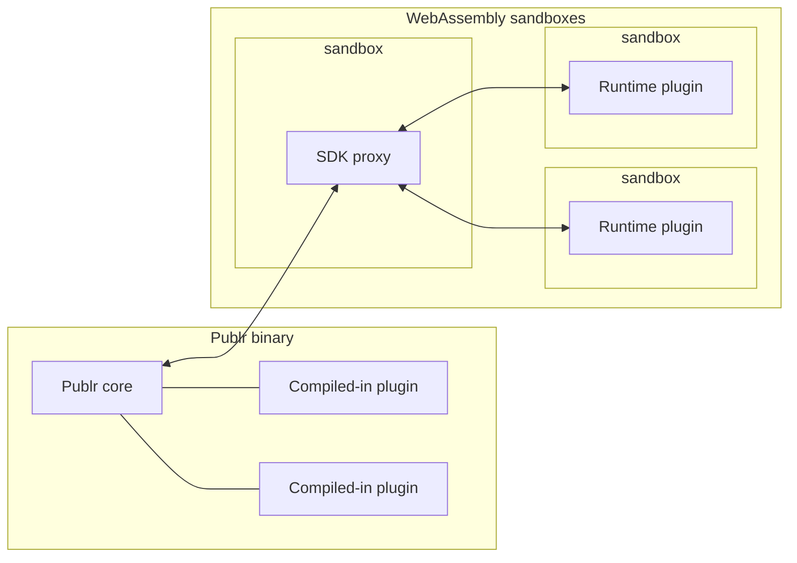
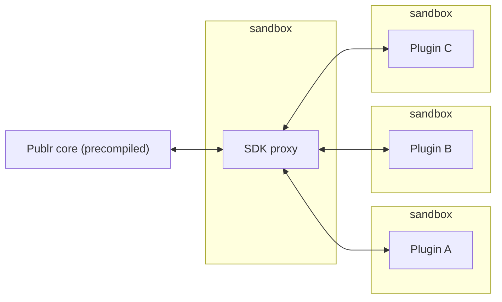

# Plugins

Publr has two ways to run a plugin. Both use the same SDK. The difference is
where the plugin lives and who decides that it is there.

## Compiled-in plugins

A compiled-in plugin is placed into the Publr binary by a developer or a
build tool. The result is a tailored Publr: one binary with every battery
someone decided to put inside.

From the user's point of view these plugins are core features. They cannot
be disabled, removed or updated from the admin. Updating one means updating
the plugin source and building a new binary.

This is sometimes called **agency mode**: a software agency prepares the
build for a client, so what the client gets is stable, has every feature they
need, and just works. Only a competent operator decides what goes in, which
makes this setup very safe and resilient.

Two things follow from being inside the binary:

- **Full access.** A compiled-in plugin can reach the whole Publr API and any
  internals. Whoever builds the binary is responsible for checking it.
- **Deep integrations are possible.** Some plugins must be compiled in because
  they need things the SDK does not expose to the outside: swapping the
  database, adding database extensions, replacing the cache layer, and other
  advanced hooks.

A plugin that uses only the public SDK can be shipped both ways: compiled in,
or as a runtime plugin.

## Runtime plugins (DLP)

Runtime plugins are the opposite. They are added from the admin, without
recompiling anything. Think of them as dynamically linked plugins, in the
spirit of DLLs, hence DLP.

Each runtime plugin is a precompiled WebAssembly module running in its own
sandbox. It never touches Publr directly: every call goes through the SDK
proxy, which dispatches through the same operation pipeline everything else uses. That gives:

- **An enforced boundary.** The plugin can only do what the SDK exposes and
  what its permission scopes allow.
- **Isolation.** A buggy plugin cannot crash Publr or read another plugin's
  memory.
- **No recompilation.** Install, update or remove a plugin from the admin,
  from a marketplace or a repository, and it just works. Publr stays one
  binary.

## Which one to pick

| | Compiled-in | Runtime (DLP) |
|---|---|---|
| Added by | developer or build tool | admin, marketplace, repository |
| Needs a rebuild | yes | no |
| Access | full, trusted | SDK only, within its scopes |
| Isolation | none, it is part of the binary | sandboxed |
| Can be removed by the user | no | yes |
| Deep integrations (database, cache, ...) | yes | no |
| Uses only the public SDK | works | works |

## Writing a compiled-in plugin

A plugin is one directory under `plugins/` with a `main.zig`. It imports one
thing, `publr`, and declares what it brings: a manifest (name, version,
summary), documented namespaces, operations exactly like the core's, policies,
hooks, statuses and content types. `zig build` finds it, compiles it in and
wires it up; nothing is registered anywhere else. Its operations appear in the
CLI and every other adapter, documented like the core's.

Storage is content types and snapshots. A plugin that needs to keep things
declares a type (`pub const content_types = [_]publr.plugin.ContentTypeDef{...}`,
usually private) and works with it through the record operations. The type is
created, or brought up to date, when the database opens, owned by the plugin:
it shows in the types manager as a system type, its declared fields are
locked, and editors can add fields of their own that survive the next
redeclaration. Its records get validation, permissions, listing, filtering
and the admin for free. History goes into
snapshots (`snapshot take/list/prune`, kinds of the plugin's own); parked
copies of a document go into slots (`record get --slot`), like the core's
`pending`. Only a compiled-in plugin that truly needs its own table
(`compiled_in_only`) may ship `schema_sql`.

The contract is checked when the binary compiles: a missing manifest, a bad
name, an undocumented operation, a hook on an operation that does not exist,
two plugins with the same name, all stop the build with a message naming the
plugin. Plugins are applied in name order, always. Tests live next to the code
and run with `zig build test`. The `plugins/` directory is yours: Publr's own
repository does not track it, so a fork can commit its plugins alongside the
core.
