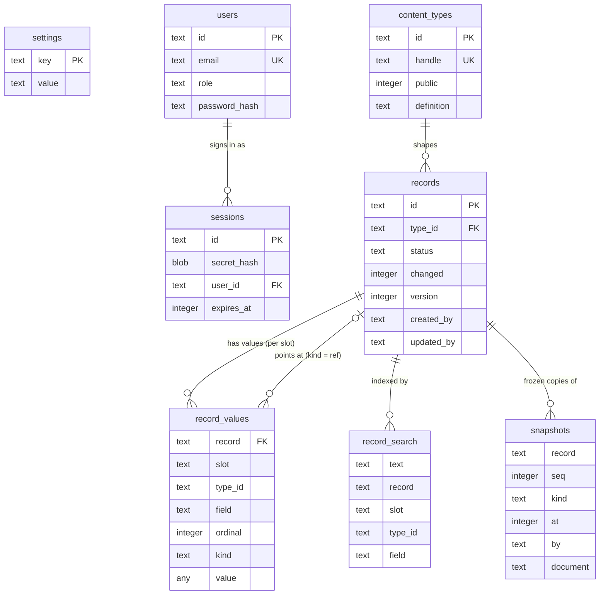

# Database schema

Publr keeps everything in one SQLite file (`data/publr.db` by default), in
strict tables created by `src/lib/db/schema.sql` when the database opens. There
are no migrations: pre-release, the schema is the schema. Ids are 24 hex
characters, times are Unix milliseconds, booleans are `0`/`1`.

The shape is deliberately small. Two tables carry the content of the whole
site, whatever a plugin adds: `records` (one row per thing: a record, an
author, later a media item) and `record_values` (one row per field value, in
a named *slot*: `live`, `pending`, or a plugin's own copy). A content type
says which fields a record has; the type is data (`content_types`), plugins
declare their own types in code and they are created when the database
opens. Plugins therefore extend storage by adding **types and fields, not
tables**. History is the other storage shape: `snapshots`, frozen read-only
copies of documents (revisions and whatever else a plugin archives). The rest
is authentication (`users`, `sessions`), site settings (`settings`), and the
full-text index (`record_search`).

`settings` stands alone: a key/value table the core and plugins read one row
at a time; it is not a record.

## `settings`

Site-wide key/value settings, one row per setting, written by the core
(`site.init` records `site.initialised_at`), later by the settings operations
and by plugins under their own dotted prefix (`seo.default_image`).

| Column | Type | Meaning |
|---|---|---|
| `key` | text, primary key | Setting name, dotted (`site.initialised_at`) |
| `value` | text | The value as text |
| `updated_at` | integer | Last write |

## `users`

Accounts. Roles are `admin` or `editor`. An account without a password hash
is inactive: it was created with a set-password link and cannot sign in until
the link is redeemed.

| Column | Type | Meaning |
|---|---|---|
| `id` | text, primary key | Account id |
| `email` | text, unique | Sign-in email, lowercased and trimmed |
| `display_name` | text | Name shown in the admin |
| `password_hash` | text, nullable | Argon2id PHC string; null while inactive |
| `password_token_hash` | blob, nullable | SHA-256 of the current set-password token |
| `password_token_expires_at` | integer, nullable | When that token stops working |
| `role` | text | `admin` or `editor` |
| `created_at`, `updated_at` | integer | Timestamps |

## `sessions`

Signed-in sessions. The client holds `id.secret`; only the hash of the
secret is stored. Rows slide (expiry extends on use) and are removed by
sign-out, expiry cleanup, or the per-user cap (32 newest kept). Deleting a
user removes their sessions.

| Column | Type | Meaning |
|---|---|---|
| `id` | text, primary key | Session id (the public half of the token) |
| `secret_hash` | blob | SHA-256 of the secret half |
| `user_id` | text, references `users` | Whose session; cascades on delete |
| `expires_at` | integer | Absolute expiry |
| `created_at` | integer | When it was created |

Indexes: `sessions_user_id (user_id)`, `sessions_expires_at (expires_at)`.

## `content_types`

Content types are data: the schemas of records. The full definition (fields
included) is stored as JSON in `definition`; a few properties are also
columns for listing. A type's id is derived from its handle (SHA-256, first 24
hex characters), so a type declared in code has the same id in every database.
Types created through `content_type create` and types declared by plugins
(`pub const content_types` in the plugin, applied by `SDK.bootstrap` when the
database opens) live side by side in this table.

| Column | Type | Meaning |
|---|---|---|
| `id` | text, primary key | Type id, from the handle |
| `handle` | text, unique | Machine name (`post`) |
| `name`, `name_plural` | text | Display names |
| `icon` | text | Icon name for the admin |
| `public` | integer | `1` if anonymous callers may read its live records |
| `system` | integer | `1` when a plugin owns the type (`owner` in the definition names it): its declared fields are locked, fields added by hand on top are kept across redeclarations |
| `editor` | text | Editor to use (`form` by default) |
| `editor_config` | text | Editor configuration as JSON |
| `definition` | text | The complete definition as JSON (source of truth) |
| `created_at`, `updated_at` | integer | Timestamps |

## `records`

One row per record: identity, status and the columns every list needs. A
record's field values live in `record_values`, not here; the title shown in
lists is the value of the type's `title_field`, joined in. `version` grows on
every write and status change and is the optimistic-concurrency token.
Deleting a type deletes its records; deleting a record deletes its values.

Two axes: `status` is publication (`draft`, `published`, `archived`,
`deleted`; moved by transitions), `changed` is editing: `1` while a live
record has edits parked in its `pending` slot, whatever the status. Unpublish,
archive and delete leave `changed` and the pending copy alone.

| Column | Type | Meaning |
|---|---|---|
| `id` | text, primary key | Record id |
| `type_id` | text, references `content_types` | Its type; cascades on delete |
| `status` | text | A status id from the registry (`draft`, `published`, ...) |
| `changed` | integer | `1` when a pending copy holds unpublished edits |
| `version` | integer | Version, starts at 1 |
| `created_at`, `updated_at` | integer | Timestamps |
| `created_by` | text, nullable | The user who created it (a fact, not a byline) |
| `updated_by` | text, nullable | The user of the last save or transition |

Indexes: `records_list (type_id, status, updated_at)`; `records_changed
(type_id, updated_at) WHERE changed = 1`.

## `record_values`

Every field value of every record, one row per value, under a slot. There is
no JSON document in the database; reads assemble one from these rows, and
every scalar field of the live slot is filterable and sortable through the
index.

A slot is a named copy of the document. The core uses `live` (what everyone
reads) and `pending` (edits parked on a live record, promoted to `live` by
`record publish`, dropped by `record discard_changes`); a plugin may keep its
own (`release:<id>`) and promote it the same way. Only `live` is indexed:
filters, sorting, slug uniqueness, referrers and delivery search never see
other slots; `record get --slot` reads one explicitly (previews).

| Column | Type | Meaning |
|---|---|---|
| `record` | text, references `records` | The record; cascades on delete |
| `slot` | text | Which copy: `live`, `pending`, or a plugin's own |
| `type_id` | text | The record's type (a copy of `records.type_id`, so filters hit the index without a join) |
| `field` | text | Dotted path to the leaf field (`title`, `seo.description`, `faq.question`) |
| `ordinal` | integer | Position inside the nearest repeated ancestor (many reference, repeater item); `0` otherwise |
| `kind` | text | Storage kind, from the field kind: `int` (integer, datetime ms, boolean `0`/`1`), `real` (number), `text` (string, slug, email, url, select), `ref` (reference and image target ids), `long` (text, richtext) |
| `value` | any | The value in the storage class its kind requires (a `CHECK` enforces it) |

Primary key `(record, slot, field, ordinal)`. Indexes: `record_values_lookup
(type_id, field, value, record) WHERE slot = 'live' AND kind <> 'long'` makes
every scalar field filterable and sortable and answers uniqueness probes
(slugs); `record_values_referrers (value) WHERE slot = 'live' AND kind = 'ref'`
answers "who points at this id" (`record referrers`). Long text is stored in the same table but kept
out of both indexes. Uniqueness within a type (a slug) is checked by the
write inside its transaction through the lookup index.

## `record_search`

FTS5 index over the values of fields marked `searchable`, one row per value,
rebuilt for a record on every save; `record list --search` joins it.

| Column | Meaning |
|---|---|
| `text` | The indexed text |
| `record`, `slot`, `type_id`, `field` | Unindexed identifiers; delivery search matches `slot = 'live'` |

## `snapshots`

Frozen, read-only copies of a record's document, numbered per record. The
other storage shape: records are queryable content, snapshots are a sealed
archive, so the document is stored whole as JSON here (never queried by
field, never edited, may number in the millions: one row each, no index load
on content). The core takes one of kind `revision` whenever a live document
is replaced (a draft save, a publish of pending edits); plugins take their
own kinds (`snapshot take`). Restore is a normal `record save` of the stored
document. `snapshot prune` keeps the newest N of a kind; purging a record
removes its snapshots.

| Column | Type | Meaning |
|---|---|---|
| `record` | text | The record it is a copy of |
| `seq` | integer | Sequence within the record, from 1 |
| `kind` | text | Why it exists: `revision`, or a plugin's name for it |
| `at` | integer | When it was taken |
| `by` | text, nullable | The acting user |
| `document` | text | The frozen document as JSON |

Primary key `(record, seq)`; index `snapshots_kind (record, kind, seq)`.

## Coming with later gates

`media` (files: name, mime type, size, dimensions, storage key, hash) joins as
a record type with the media gate; API token tables come with the tokens
gate. A compiled-in plugin that truly needs its own table names it
`<plugin>_<table>` and creates it from `schema_sql` when the database opens;
the default, for every plugin, is a declared content type.
