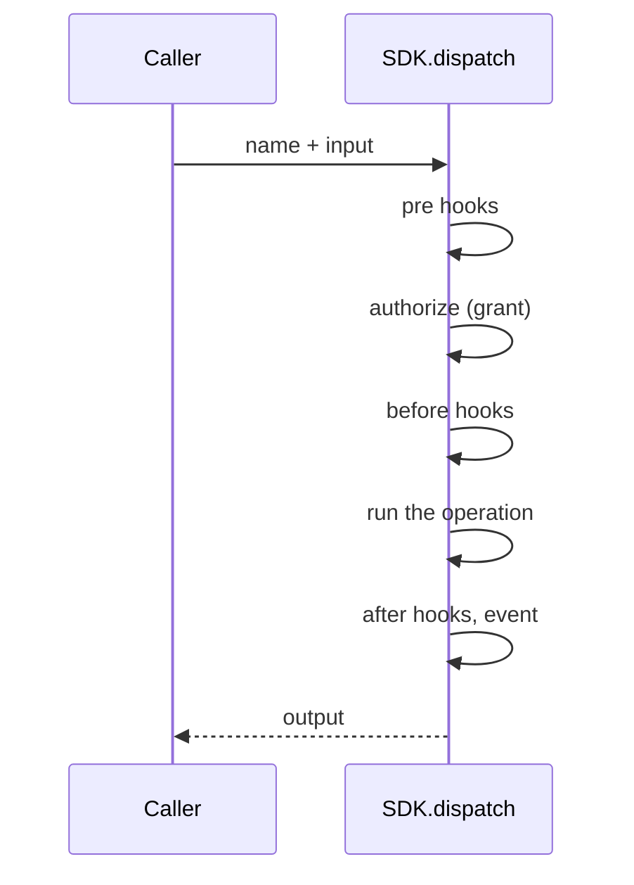

# SDK

The SDK is everything a plugin, an admin page or an integration needs to
extend Publr. It has three parts:

- **Operations**: the API surface. Every capability of Publr is one.
- **Hooks**: how to plug into what already exists.
- **UI**: the components and pages the admin is made of.

Nothing outside the SDK is available to a plugin. Nothing inside it is
reserved for the core.

## Operations

An operation has a **name** (`namespace.verb`, e.g. `heartbeat.check`), a
one-line **description**, an **input**, an **output**, and a **kind**: it
either reads or it writes.

Inputs and outputs are plain data: text, numbers, booleans, lists, small
records. No pointers, no callbacks, nothing that cannot be written down as
JSON. This is what lets the same operation be called from Zig, from the
command line, over HTTP and from a plugin sandbox without translation.

Every operation also carries one **example input**. The example is used to
prove, automatically, that the operation behaves identically whichever way it
is called.

### Dispatching an operation



1. The caller hands a name and input to `SDK.dispatch`.
2. The SDK runs the pre hooks, authorizes the call (producing a grant), and
   runs the before hooks.
3. The SDK runs the operation with its grant, calling the internals
   directly, inside a transaction if it writes.
4. The SDK runs the after hooks, emits the event, and returns the output to
   the caller.

### Running an operation

`dispatch` runs the operation now and returns its output. An operation that
dispatches another operation runs it immediately, inside its own transaction,
and remembers that it caused it. There is no deferred or background form: if
something should happen later (a scheduled publish, a notification), a plugin
keeps that intent as a record and runs the operation when the time comes.

### The grant

Authorization returns a grant, not a boolean. A grant can say:

- allowed or denied;
- read-only;
- only these content types, only these statuses;
- only records the caller owns, or only records a plugin-supplied check accepts;
- hide or refuse these fields;
- only these status transitions.

The operation is responsible for honouring its grant: filtering what it lists,
refusing what it may not write. Tests exercise every operation under a
restrictive grant to make sure it does.

### Callers

The pipeline always knows who is calling: an anonymous visitor, a user (with a
role, `admin` or `editor`), a user token, a machine token with its own policy,
the local operator (`system`), or a plugin with a set of permission scopes.
Policies use this to decide the grant. The CLI runs as anonymous unless told
otherwise (`--as <user id or email>`, `--as-admin`).

Users and sessions are ordinary operations: `site.init` (first admin,
exactly once), `user.create` (with a password, a generated one, or a
set-password link), `users.password_link`, `users.set_password`,
`user.list`, `user.sign_in` (sign in: email + password to token) and
`users.sign_out` (sign out). The HTTP adapter wraps sign-in, sign-out and
set-password as `POST /api/auth/sign-in|logout|set-password` with a cookie, and
`GET /api/auth/session` says who the cookie belongs to.

### Self-describing operations

Operations are grouped in namespaces (`users`, `heartbeat`, later
`record`, `content_type`, ...), and a namespace is declared with a summary and an
explanation of what lives in it; the SDK refuses an operation whose
namespace is undocumented. An operation carries its own documentation next
to its code: a one-line
description, a longer explanation (who may call it, what it changes, how it
fails), a note per input and output field, an example input, an example
output, and the caller the example runs as. Every adapter renders the same
text: `publr <namespace> <verb> --help` prints all of it with a runnable
example and its JSON, and the REST adapter will serve it. Documentation that
lives in the operation cannot drift from the operation.

### The shape

Just enough to see it; the full contract lives in the code and tests.

```zig
pub const Check = struct {
    pub const name = "heartbeat.check";
    pub const description = "Check that Publr is alive; reports version and caller";
    pub const kind = .read;
    pub const In = struct { echo: []const u8 = "" };
    pub const Out = struct { version: []const u8, echo: []const u8, caller: []const u8 };
    pub const example: In = .{ .echo = "hello" };
    pub const example_out: Out = .{ .version = "0.2.0", .echo = "hello", .caller = "system" };
    // run(ctx, in, grant): the work
};
```

That is the whole contract: a name, a sentence, read or write, the input and
output structs, one example call with the answer it gives, and `run`. Optional:
`details`, `field_docs`, `output_docs` for richer help. What a call touches, for
policies, is read from the input by field name (`type`, `id`, `to`).

The example is not decoration. `--help` prints it, and `zig build parity` runs
it: every operation's printed command line is executed against a database built
for it, and the answer is checked against the printed `example_out`. An example
that stops being true fails the build.

## Hooks

Hooks are how a plugin plugs into behaviour that already exists. There are
five kinds:

| Hook | When | Can |
|---|---|---|
| **pre** | before authorization, for every call | veto (rate limits, abuse protection) |
| **before** | after authorization, on a named operation | see and change the input, or veto |
| **after** | on a named operation, after it ran | observe input and output |
| **on event** | for any operation | react to completed, rejected, failed, or a notice an operation raised |
| **policy** | during authorization | narrow the grant |

An operation can raise a **notice** while it runs (`ctx.notice(name, subject)`),
a named event with a subject that reaches every event hook. The core raises
`auth.user_created`, `auth.sign_in_succeeded`, `auth.sign_in_failed`,
`auth.sign_in_throttled`, `auth.sign_in_locked`, `auth.sign_out`,
`site.initialised`, `auth.password_link_issued` and `auth.password_set`; for
content, outcomes rather than mechanics: `record.created`, `record.saved` (a
document was written), `record.changed` (first pending edit on a live record),
`record.changes_saved`, `record.changes_discarded`, `record.published` (a new live
version, whether from a draft or from pending edits: one listener for "on
publish"), `record.unpublished`, `record.archived`, `record.deleted`,
`record.restored`, `record.purged`, plus `record.transitioned` for every status
move and `content_type.created|updated|deleted`.

Beyond hooks, a plugin registers its own **operations**, **statuses** and
**content types** (created when the database opens; the plugin's own records
live in the same tables as everything else). Drafts, revisions, workflows,
activity logs, notifications and live updates are all built from these
pieces.

## UI

The admin is built from a shared component kit and pages authored in a
portable JSX dialect. A plugin ships its pages and slot contributions in that
same dialect and imports the same components; the compiler turns them into
server-rendered and client-side code. Pages load their data by calling
operations, so plugin UI gets permissions and logging for free.

## Testing

Every operation's documentation is executable. `zig build parity` gives each one
a fresh database, seeds what its example names, reads the example command line
back off the binary's own `--help`, runs exactly that, and checks the answer
against the printed `example_out`. So an operation cannot ship documentation
that does not work, and the CLI adapter cannot drift from the operation without
the build noticing. Operations also test their own behaviour, including under
restrictive grants.
